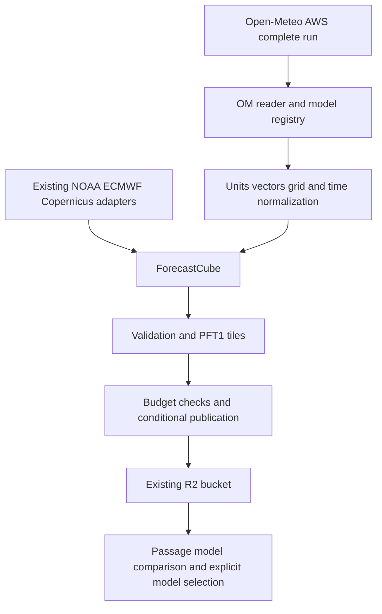

# Open-Meteo bulk integration implementation plan

Status: proposed implementation; no runtime changes or model activation.
Prepared 2026-10-02 against forecast-tiles commit `12a7fb5`.

Add new deterministic weather models by reading Open-Meteo's public AWS bulk
files and converting them into the existing PFT1 tiles. Keep every existing
forecast layer on its current provider, with its current variables, grids,
cycles, forecast horizon, retention and fallback behavior. The first release
adds AROME, ICON-EU and UKV in stages. Later releases reuse the adapter for
other verified models.

This plan supersedes the direct-provider implementation order in the earlier
[regional model access assessment](regional-model-access.md). That assessment
remains the reference for provider alternatives and models absent from the
Open-Meteo bulk catalogue.

## Decisions and boundaries

- Read public S3 objects anonymously. No hosted Open-Meteo API calls, API key,
  paid subscription, self-hosted Open-Meteo server or permanent database mirror.
- Use complete, individual forecast runs from `data_run/` by default. Evaluate
  `data_spatial/` during the pilot, but do not implement two production readers
  unless the measurements justify it. Do not use rolling `data/` files for
  immutable forecast runs: they can contain updates from different cycles.
- Publish each new model as a distinct layer. Do not replace GFS, relabel a
  regional model as GFS, or silently blend models at a domain boundary.
- Start with surface wind u/v and gust where its definition is verified.
  Additional hazard variables are a later extension with a separate size and
  semantics assessment. New models are deterministic, not ensemble members.
- Preserve the PFT1 binary layout and existing tile URLs. Extend JSON schemas
  and consumer registries additively before publishing new layers.
- Retain current plus previous run for each new layer. Store converted tiles
  in the existing project bucket; keep raw OM files and interpolation caches
  on the ingestion runner only. A second Cloudflare account is not required.
- Keep existing model sources and schedules unchanged. Shared publisher and
  scheduler improvements below must pass compatibility tests for those layers.
- A listed model is a candidate, not proof that every required variable and
  run is available. Live metadata and decoded samples are release gates.

### Existing layers to preserve

| Layer | Source and behavior retained |
|---|---|
| `weather` | NOAA GFS 0.25°, current wind/gust and hazard variables, current axes to 240 h, four cycles/day |
| `weather-ecmwf` | ECMWF open data, 00/12Z to 240 h, existing gust interval metadata |
| `weather-ecmwf-short` | ECMWF open data, 06/18Z to 144 h, existing gust interval metadata |
| `ensemble` | NOAA GEFS, all 31 members, existing mean/anomaly encoding and axes to 384 h |
| `waves` | NOAA GFS-Wave, existing wave/wind-wave/swell variables and horizons |
| `currents` | Copernicus GLO12, current six-hourly surface currents and existing RTOFS outage fallback |
| `currents-ibi` | Copernicus IBI, current regional hourly means through 120 h |

The shoreline/bathymetry routing-index pipeline is outside this change.
Open-Meteo does not publish the GEFS ensemble in this bulk distribution, and
its catalogue is not a like-for-like replacement for our two current layers.

## Model order and product definitions

These are proposed layer IDs and initial publication policies. Horizons and
grids below are expectations from the catalogue and implementation references,
not results of a live download. Freeze the validated definition in the model
registry before the first production run.

| Stage | Model and proposed layer | Open-Meteo domain | Initial output and run policy |
|---|---|---|---|
| Pilot | AROME, `weather-arome` | `meteofrance_arome_france0025` | Preserve regular 0.025° grid; expected 0–51 h; select 00/06/12/18Z |
| Release 1 | ICON-EU, `weather-icon-eu` | `dwd_icon_eu` | Preserve regular 0.0625° grid; main cycles to 120 h with native time spacing; 00/06/12/18Z |
| Release 1 | UKV, `weather-ukv` | `ukmo_uk_deterministic_2km` | Remap projected 2 km grid to proposed 0.025° geographic grid; expected 0–54 h; 00/06/12/18Z |
| Release 2 | ICON-D2, `weather-icon-d2` | `dwd_icon_d2` | Preserve regular 0.02° grid; expected 0–48 h; initially four cycles/day |
| Release 2 | HRRR CONUS, `weather-hrrr` | `ncep_hrrr_conus` | Remap Lambert grid to proposed 0.025°; select extended 00/06/12/18Z runs, expected through 48 h |
| Release 2 | HRDPS, `weather-hrdps` | `cmc_gem_hrdps` | Remap rotated grid to proposed 0.025°; expected 0–48 h; four cycles/day |
| Optional expansion | AROME HD, `weather-arome-hd` | `meteofrance_arome_france_hd` | Preserve 0.01° distribution grid; bounded coverage first because of size; separate product from standard AROME |
| Optional expansion | ARPEGE Europe, `weather-arpege-eu` | `meteofrance_arpege_europe` | Preserve 0.1° grid; validate cycle-dependent horizon |
| Optional expansion | ARPEGE global, ICON global, ACCESS-G | `meteofrance_arpege_world025`, `dwd_icon`, `bom_access_global` | Separate global additions only if useful and budgeted; no replacement of current globals |
| Optional expansion | DMI/KNMI HARMONIE, Nordic and Swiss products | Catalogue-specific domains | Add per geography after verifying grid, variables, member/product identity and access |

The four-cycle policy is an initial operating choice, not a claim that these
providers update only four times daily. After measuring costs and publication
lag, AROME, ICON-D2 and UKV can move to three-hourly ingestion without retaining
more runs. Do not infer that every hourly model run is retained in `data_run/`:
the public run archive retains at most one run every three hours.

UKV's direct provider also describes longer products, but this plan does not
promise a 120 h UKV forecast through Open-Meteo. Enable only horizons present
and verified in the chosen bulk feed. HRRR Alaska is a separate product, not
part of the CONUS layer.

NEMS, national ALADIN products and ACCESS-C are not committed additions through
this route: suitable bulk entries have not been established. NAM is deferred
because the NOAA registry announces its retirement on 2026-10-14; reassess the
transition and any RRFS bulk availability before choosing a successor. Do not
substitute ACCESS-G for ACCESS-C or generic HARMONIE for a named ALADIN product.

## Data flow



The ingestion runner handles downloads and conversion. The Cloudflare Worker
continues to dispatch GitHub Actions; it does not download weather arrays.
Browsers continue reading our tiles, with no runtime Open-Meteo dependency.

### Bulk discovery and complete-run selection

Implement the following algorithm in a new source adapter:

1. Resolve a registered model and its allowed cycle hours. For an explicit
   `--cycle`, request exactly that cycle. Otherwise select the newest complete
   allowed cycle, with bounded lookback to an older complete cycle.
2. Read the run catalogue metadata. The inspected implementation writes
   `data_run/<domain>/latest.json` and
   `data_run/<domain>/YYYY/MM/DD/hhmmZ/meta.json`. Verify those live paths in
   Phase 0. Construct allowed run candidates rather than listing the bucket.
3. Check reference time, required variable names, valid times and grid
   identity. Presence of `meta.json` is the upstream completion signal, but
   still confirm that required objects exist and cover the intended product.
4. Capture the run metadata and source object identities: key, ETag, length
   and modification time. Decode each variable's own reference time, units,
   dimensions and timestamps. Do not assume all variables have the same axis
   or that their first element is lead zero.
5. Read only required variables, spatial ranges and forecast times. Pin object
   identity with conditional range reads where supported; otherwise verify
   identities before and after the read. Reject a run that changes during
   ingestion. Do not publish mixed object versions.
6. Require the registered wind time axis and domain to be complete. Missing
   files, unexpected timestamps or a changed grid fail the run; an explicitly
   documented missing analysis gust can remain missing. A truncated download
   must never masquerade as a shorter valid forecast.
7. Normalize, validate and publish. An explicit cycle that is not available
   waits within `--wait-minutes` and then fails with a useful status. Automatic
   selection may retain the previous forecast, recording that it is stale.

Run-based files remain public for three months; spatial files for seven days.
Those upstream retention windows do not change our two-run R2 policy. Do not
use `in-progress.json` to publish a partial regional forecast.

Use bounded retries with jitter for transient connection errors, throttling
and 5xx responses; honor `Retry-After`. Treat 404 as potentially pending only
within the expected publication window. Treat unknown formats, changed grids
and invalid values as validation failures. Start with four download workers,
bounded block caching and finite request/read timeouts; tune from measurements.

### Reader and dependency choice

Evaluate the official Python `omfiles` reader, which supports NumPy slicing,
hierarchical spatial files and anonymous S3 through fsspec. Its inspected
version advertises Python 3.13 wheels, matching the current workflows. Add a
separate `openmeteo` extra in `pyproject.toml` so existing ingestion workflows
do not install new dependencies. Pin compatible versions through `uv.lock`.

Candidate dependencies are `omfiles[fsspec,grids]` and `pyproj`; avoid a full
xarray/Dask stack unless the pilot demonstrates a need. Check s3fs/aiobotocore
compatibility with the project's boto3 constraints before selecting versions.
Anonymous source reads and authenticated destination R2 writes must use
separate clients; do not send R2 credentials to the public source bucket.

Software and data licences are separate. The inspected Python reader declares
GPL-2.0-only, the full Open-Meteo server declares AGPLv3, and the bulk catalogue
declares CC BY 4.0. Record the chosen reader's licence and distribution
obligations before shipping it; do not copy server implementation code or
silently change this repository's licence. Record model-specific attribution
and upstream terms as well, particularly the Met Office's CC BY-SA listing.
Resolve the applicable redistribution notice for UKV before enabling it.

### Model registry and source modules

Keep the existing source modules and dispatch branches intact. A registry for
the new models should carry the following explicit fields:

- Layer ID, stable model/product ID, display name, Open-Meteo domain and an
  adapter/configuration version.
- Allowed cycles, actual scheduled cadence, expected time axes by cycle,
  maximum lookback, expected publication lag and stale threshold.
- Required input variables, units, vector reference frame, conversion rules,
  gust definition/windows and output variable specifications.
- Accepted source grid/CRS fingerprint, served grid, coverage/mask policy and
  any fixed geographic crop. Reject unreviewed grid changes.
- Per-run byte limit, runtime and memory limits, production enablement flag,
  attribution and source-document references.

| File or area | Proposed responsibility |
|---|---|
| `src/ingest/sources/openmeteo/registry.py` | New model definitions and production allowlist |
| `src/ingest/sources/openmeteo/catalog.py` | Metadata parsing, cycle selection, readiness and object identity |
| `src/ingest/sources/openmeteo/reader.py` | Range reads, OM dimensions/metadata, bounded local cache |
| `src/ingest/sources/openmeteo/grids.py` | Geographic normalization, projection transforms, cached interpolation weights and masks |
| `src/ingest/sources/openmeteo/adapter.py` | Model-aware variable conversion and `ForecastCube` construction |
| `src/ingest/cli.py` | Route new layer IDs to the adapter; preserve existing command behavior |
| `scripts/probe_openmeteo.py` | Read-only live sample, geometry/time audit and benchmark report |
| `tests/fixtures/openmeteo/` | Small redistributable samples with source identity and attribution |
| `tests/test_openmeteo_*.py` | Reader, semantics, grids, completeness and integration checks |
| `.github/workflows/ingest-openmeteo.yml` | One reusable workflow taking an allowlisted new-model layer input |

These are planned files and commands; they do not exist as part of this
documentation change. Expected local pilot command after implementation:

```sh
uv run --extra openmeteo ingest weather-arome --cycle YYYYMMDDTHH --dry-run /tmp/arome-tiles
```

Keep credentials out of reports and public workflow artifacts. Record useful
benchmark summaries, rather than uploading complete raw model files as Actions
artifacts or caches.

## Numerical conversion and validation

### Wind and gust

Output the existing `wind_u_kt`, `wind_v_kt` and, where supported, `gust_kt`
variables. Keep the existing int16 scales of 0.01 kt for wind components and
0.1 kt for gust. The upstream compression may be coarser; these output scales
do not create additional forecast precision. Quantize only after any vector
rotation and spatial interpolation.

AROME and ICON adapters should validate the expected stored u/v fields. UKV
needs a different mapping: the inspected source stores `wind_speed_10m`,
`wind_direction_10m` and `wind_gusts_10m`. For a verified meteorological
direction measured clockwise from true north, convert speed `s` and direction
`theta` with `u = -s * sin(theta)` and `v = -s * cos(theta)`, then convert m/s
to knots. Verify that reference frame from metadata/provider definitions.

Align the first release's wind and gust arrays by actual valid timestamp onto
the registered output axis, with missing values only at documented unavailable
steps. Never align them by array position. If their sampling cannot satisfy
that product, keep gust disabled until a separate-axis definition and matching-
timestamp validation are implemented; do not interpolate interval maxima into
instantaneous gust values.

Do not interpolate angles across 359°/1°. Convert to vectors first. Rotate
grid-relative components into earth-relative east/north once where necessary;
do not apply a second rotation to fields Open-Meteo already rotated. Add
cardinal-direction and nonzero projection-angle fixtures.

Document whether each gust is instantaneous or a maximum over an interval.
Use the existing `Statistic("max", window_h)` representation for verified
integer-hour windows. Do not infer gust windows from output timestep spacing,
equate missing gust with sustained wind, or publish an unknown definition as
instantaneous. A model with unresolved gust semantics remains wind-only and
must be displayed with that reduced capability; it does not pass a wind-plus-
gust release gate. Keep subhourly products outside this first implementation.

### Geometry and coverage

AROME and ICON-EU are the first adapters because their distributed geographic
grids fit `GridMeta`. Preserve the documented origin and spacing after
normalizing latitude orientation and longitude convention. Do not infer a
grid from a nominal kilometre resolution or two noisy float32 coordinates.

For UKV, HRRR and HRDPS, map the source grid to a fixed regular geographic
grid, initially proposing 0.025° latitude and longitude spacing. This is a
served grid, not a claim of native 0.025° model resolution. Approve its exact
origin, extent and point count from live geometry and size measurements before
activation. Preserve those choices across cycles and record native and served
geometry in provenance.

Compute interpolation weights in source grid coordinates using the verified
CRS and axis order. Use bilinear interpolation for earth-relative u/v and
scalar gust, with explicit missing-neighbor rules; reject or mask unsupported
locations rather than extrapolating. Account for the source halo needed to
interpolate the requested footprint. Cache weights by source and destination
grid fingerprints and interpolation version.

Projected domains have corners outside their actual footprint. Preserve a
domain-validity mask, skip wholly empty tiles and keep missing cells missing.
Validate missingness inside the expected valid domain separately from the
fraction outside it. Do not raise the existing global-weather missing-data
threshold to accommodate regional masks. Test partial 10° edge tiles and
cross-tile interpolation against interior tiles.

Use the current cube/tile pipeline for the first models. Read and quantize in
bounded slabs, using temporary arrays or memory maps where helpful. Measure
the existing validator's decoded copies and the encoder's retained gzip
buffers, not only source-array size. If later full domains exceed the runner
budget, add blockwise validation/encoding as a measured follow-up before
enabling them; do not introduce a second tile format.

### Provenance

Each new run must identify the originating weather service and numerical
model separately from the distributor, Open-Meteo. Include source domain,
reference time, metadata/object identity digest, source update time, adapter
version, variable conversions, upstream precision, source/served geometry,
interpolation method and licence/attribution links. Store a full object
inventory once per run if needed; tile headers carry a compact reference or
digest rather than a repeated large inventory. Count that inventory in storage.

## Contracts and consumers

The canonical forecast schemas are in Passage and vendored here. Update them
together; do not change only forecast-tiles' copies.

1. Add the new layer IDs to the three forecast schemas. Permit digits in the
   layer portion of run IDs so `weather-icon-d2-YYYYMMDDTHHZ` is valid while
   retaining the existing cycle suffix and all existing IDs.
2. Add optional manifest metadata for geographic coverage, model display
   identity, native/served resolution, available capabilities and attribution.
   Decide the exact fields in the canonical contract and exercise old and new
   manifests in both repositories. Keep `time_axes.offsets_h` as integer hours.
3. Use explicit model definitions in the consumer; an unknown layer must not
   automatically become an independent model in a comparison. Test that older
   consumers tolerate additional layer entries before publishing to root
   `latest.json`. If not, deploy compatible consumers first.
4. Extend Passage's `engine/src/forecast/tileStore.ts`: its current
   `getHazardForecasts()` explicitly selects GFS and ECMWF. Add eligible regional
   models based on spatial/time coverage and available fields. Preserve the
   existing `modelRuns.ts` ECMWF combination behavior.
5. Preserve the default GFS forecast and routing behavior. Expose new models
   first through comparison and explicit selection. A separate routing/grid
   selector can request a named regional layer with coverage checks; do not
   silently change `getWindGrid()` from its current GFS source.
6. At a regional boundary or after its last forecast hour, return unavailable
   for that model. The normal GFS forecast remains available separately.
   Distinguish unsupported coverage, missing gust, stale data and source outage
   in the UI. Do not fill a regional comparison with unlabeled GFS data.
7. Update model selectors, comparison labels, provenance and export registries
   in Passage. Audit Tactician and any other consumers before exposing new
   models there. GRIB export must preserve the selected model's cycle, grid,
   forecast times and gust intervals; incomplete regional route coverage must
   be explicit. Export support is a separate acceptance item, not implied by
   successful PFT1 decoding.

New regional outputs may supply only wind/gust. Missing temperature, visibility,
precipitation and CAPE remain unavailable. Do not invent those fields or treat
their absence as zero. Do not count AROME/AROME-HD as independent evidence
without an explicit model-family policy, or count Open-Meteo as another model
alongside the same originating model.

## Publication, retention and capacity

### Prevent lost latest updates

`_update_latest()` currently reads, modifies and overwrites one shared
`latest.json`. Two different layers can lose each other's updates. Before
activating any new scheduled publisher:

- Add versioned reads and conditional writes to the store abstraction.
  Cloudflare documents `If-Match` and `If-None-Match` for S3 `PutObject`;
  validate the installed boto3 interface and a real R2 round trip.
- Read the document plus ETag, merge only this layer's entry and write with
  `If-Match`. Use `If-None-Match: *` to create a missing document. On a
  precondition conflict, reread, merge and retry with a bounded backoff.
- Reject a cycle older than the layer's current cycle at commit time, even
  if it passed the CLI's earlier duplicate check. Recover an uncertain write
  outcome by reading the pointer before retrying or deleting anything.
- Keep one active workflow per layer. All current and new publishers must use
  the conditional update path; a remaining unconditional writer defeats it.
- Protect a layer/run from overlapping manual and scheduled invocations too:
  conditionally claim an in-progress record before writing objects, record an
  owner and job lifetime, and refuse another owner. Abandoned claims require
  verified job termination before takeover. An existing completed run is an
  idempotent success or a content conflict, never an ordinary overwrite.
- Upload and validate all immutable tiles, then the complete manifest, then
  advance the pointer. Run retention only after a successful pointer update.
  Delete only this layer's unreferenced, completed older runs. Check references
  again before cleanup and exclude in-progress uploads.

Do not use a single GitHub concurrency group as a durable queue for every
model: pending jobs can be replaced and long ingestion jobs would delay current
providers. Per-layer concurrency plus conditional catalogue updates preserves
independent scheduling.

Keep published run IDs immutable. A source correction or adapter change must
not overwrite a cycle already served with immutable caching. Normally publish
the next cycle; if a same-cycle revision is required, design an explicit
revision contract first. Do not use `--force` as the routine migration method.

### Storage admission

The current default `MAX_BUCKET_BYTES` is 8,000,000,000 bytes. Its guard counts
forecast manifest tile totals retained after publication. It does not measure
the whole bucket, upload overlap, orphaned objects, metadata, the routing index
or other buckets in the same account. Do not describe it as an account billing
cap or simply disable it to make the new models fit.

Before production, measure and configure:

- A protected capacity allowance for existing layers, based on their measured
  retained and upload-peak sizes plus headroom. New models must not consume the
  allowance that existing scheduled runs need.
- A separate regional retained-byte allocation and a maximum compressed run
  size for each enabled regional model. Every model must fit its fixed share;
  borrowing spare capacity between models is deferred.
- Peak capacity for current + previous + uploading run, and metadata/staging
  bytes. Use the sum of all simultaneously allowed model peaks, not only the
  largest new model. Count orphaned objects until cleanup actually succeeds.

For per-model compressed run caps `b_i`, allocate at least `2 * sum(b_i)` for
steady regional tiles and `3 * sum(b_i)` for worst-case overlapping uploads,
then add non-tile bytes and headroom. Enforce one active run per regional model
and refuse a run exceeding its cap before uploading. Fixed allocations avoid
two regional publishers both assuming they own the same remaining capacity;
the existing read-then-check global guard alone does not solve that race.

Reconcile actual project object sizes periodically and after failed cleanup.
Fail regional admission on unknown or exhausted capacity, retaining the prior
good runs. Protect the existing allowance when changing the aggregate guard.
Do not shrink existing model coverage or retention to fund a new layer.
Treat these limits as project capacity controls: account-wide billing still
requires account usage monitoring, and a measured allowance is not a guarantee
against unlimited future growth elsewhere.

Cleanup must distinguish abandoned uploads from active work using run activity
and a grace period longer than the maximum job lifetime. Never delete a run
referenced by current/previous pointers. Budget for both retained runs and
client refresh behavior before choosing any additional rollback grace period.

### Initial sizing and expense

The following figures are planning arithmetic for **two runs, three int16
fields, before gzip**, using inspected source-grid dimensions and expected
time counts. They exclude headers and upload overlap. They are not measured R2
sizes or download volumes, and projected-model destination grids can contain
a different number of points.

| Model | Points × forecast times | Two-run raw field size, decimal GB |
|---|---|---:|
| AROME 0.025° | 1121 × 717 × 52 | 0.502 |
| ICON-EU | 1377 × 657 × 93 | 1.010 |
| UKV source-grid proxy | 1042 × 970 × 55 | 0.667 |
| ICON-D2 | 1215 × 746 × 49 | 0.533 |
| AROME HD | 2801 × 1791 × 52 | 3.130 |
| HRRR source-grid proxy | 1799 × 1059 × 49 | 1.120 |
| HRDPS source-grid proxy | 2540 × 1290 × 49 | 1.927 |

Formula: `nx * ny * time_count * 3 variables * 2 bytes * 2 runs`.
The first three sum to about 2.18 GB on those assumptions. Replace these
estimates with measured gzip totals on the approved served grids before
setting budgets. Reducing publication frequency reduces downloads and writes,
but does not halve storage when retention remains two runs.

At the documented R2 Standard rate, each additional billable GB-month costs
about $0.015 before rounding/tax. The account's 10 GB-month free storage,
1 million Class A and 10 million Class B operations are shared across its
buckets. Storage billing uses average daily peaks, so temporary third runs
matter. Calculate costs from account totals outside the public repository;
do not copy private account screenshots, bucket inventories or identifiers
into this plan.

For each trial, report downloaded bytes and request count, compressed run
bytes, steady/peak R2 bytes, expected monthly PUT/LIST/GET operations, runtime,
CPU time, peak RAM and temporary disk use. Include failed/retried downloads,
metadata polls, readback checks and cleanup traffic. Current public-repository
standard GitHub-hosted runners may cover compute, but verify runner eligibility,
limits and artifact storage rather than promising every resource is free.

Open-Meteo publishes no numerical bulk-download quota in the inspected
documentation; that is not a throughput or availability guarantee. There is
no paid Open-Meteo API subscription in this design. A zero incremental R2 bill
cannot be promised without the measured additions and current account usage.

If capacity is insufficient, leave the affected new model disabled, then
consider a declared geographic crop, fewer new models, a shorter documented
forecast horizon or coarser served grid. Benchmark the revised product before
activation and preserve its identity in metadata. Do not change existing
layers, invent compression ratios or move accounts to claim a free solution.

## Scheduling and operations

Use a single `*/5 * * * *` Worker cron with timetable entries for both existing
and new layers. The current five cron expressions consume the account's free
trigger allowance; their existing dispatch minutes are all on five-minute
boundaries. Replay a full UTC day and month/year rollover cases to demonstrate
that the seven existing layers receive exactly the same cycle requests and
wait windows after this scheduler-only change.

Add an explicit workflow/model field to new timetable entries. Existing
entries keep their workflow names. New entries dispatch `ingest-openmeteo.yml`
with an allowlisted layer and explicit cycle. Validate inputs again in the
workflow/CLI and use a concurrency key per layer with cancellation disabled.
Add a scheduled catch-up path that enumerates only enabled models, skips
already-published cycles before array downloads and bounds parallel jobs.

Derive dispatch offsets from observed Open-Meteo completion times, not raw
provider publication times. Start each model with manual dry runs, then
00/12Z canary ingestion, then the proposed four-cycle schedule. Give the new
workflow a bounded wait and job timeout below GitHub's job limit. Stagger large
models to avoid starving current workflows. Worker deployments remain a
maintainer operation as documented in the repository.

Extend per-layer status with last attempt, last successful cycle, source lag,
failure category, chosen layout, source bytes/requests, gzip bytes and timings.
A failed attempt must not replace the last successful catalogue entry.
Flag stale data after two missed scheduled publication opportunities, allowing
for the measured source lag. Provide a manual retry and a per-model disable
switch. Use workflow summaries and existing operational surfaces; external
notifications are not part of this implementation.

## Delivery phases and acceptance criteria

### Phase 0 — Verify the feed and measure the pilot

Build the read-only probe and gather at least two complete cycles for AROME,
ICON-EU and UKV, including all required surface variables. Compare `data_run/`
with spatial reads on the same cycle and geographic footprint. Start with a
Channel/Biscay sample and UK/Ireland points, then measure the approved full
served domains. This sample crop is a benchmark, not a silent product limit.

Record paths, reference/valid times, per-variable axes, grid fingerprints,
units, vector reference frame, gust windows, object stability, attribution,
reader dependency versions and licence decisions. Pin the chosen metadata
schema in fixtures and detect future incompatible changes.

**Exit:** reproducible offline samples and a measured size/resource report;
each intended variable has a verified definition. A missing essential field,
unresolved licence or incompatible grid leaves that model disabled. No R2
production writes are needed for this phase.

### Phase 1 — Implement the reusable reader and AROME adapter

Add the dependency extra, registry, resolver, bounded reader and regular-grid
normalization. Implement AROME dry runs with complete wind/gust semantics and
per-run provenance. Add model-aware mask/axis validation without changing
existing model thresholds. Add fixture-based tests and a local PFT1 round trip.

**Exit:** two different AROME cycles decode and tile correctly; intentional
missing analysis values, corrupt data, incomplete runs and source mutations
are handled correctly. Peak RAM targets less than 6 GiB and temporary disk less
than half the measured runner free space. Otherwise reduce working-set size
before production; do not silently reduce the forecast product.

### Phase 2 — Make contracts and publication ready

Coordinate additive schema changes with Passage. Implement conditional latest
updates for every publisher, cycle monotonicity, safe retention and regional
capacity allocations. Keep new production enablement false. Validate the R2
conditional-write behavior in an isolated test prefix before using it for
root `latest.json`; a local fake alone is insufficient.

**Exit:** concurrent different-layer publications preserve both updates;
same-layer stale completion cannot roll back latest; upload/manifest/pointer
failures keep the prior good forecast; capacity exhaustion rejects new models
without evicting current layers. Existing fixture output and schedules pass
regression checks. Old and new consumer schema compatibility is demonstrated.

### Phase 3 — Integrate the consumer and activate AROME

Add regional model comparison, explicit selection, coverage/staleness labels
and attribution in Passage. Keep existing default forecast and routing
selection. Verify exports if included in the release; otherwise leave the new
export option unavailable. Test local tiles in the real consumer before R2.

Run the AROME canary through at least seven consecutive days, including a run
replacement, an unavailable-source scenario, a retry and a disabled-model
rollback. Use local failure injection for outages that do not occur naturally.
Observe existing workflows during the same period.

**Exit:** numerical/coverage checks pass, at least 95% of scheduled canary cycles
publish within the configured completion-plus-ingestion window, every missed
cycle has a recorded cause, and measured resources fit the configured budget.
No validation failure may publish. Existing model outputs and delivery remain
unaffected. Expand to four daily cycles only after this gate.

### Phase 4 — Add ICON-EU and UKV

ICON-EU reuses the regular-grid path; test its change from hourly to three-hourly
forecast steps. UKV adds speed/direction conversion, projection/masking and
cached interpolation weights. Validate UKV's actual bulk horizon and gust
windows rather than borrowing assumptions from direct-provider products.

**Exit:** each model passes its own Phase 0 measurements, offline numerical
tests, consumer coverage tests and seven-day canary. Size the combined upload
peak before enabling all three. The first release is complete when AROME,
ICON-EU and UKV are available as distinct, correctly attributed model choices.

### Phase 5 — Expand selectively

Add ICON-D2, HRRR CONUS and HRDPS using the same acceptance gates. Projected
grids need independent reference samples even when the transformation code is
shared. Evaluate AROME HD and ARPEGE next if their coverage justifies the bytes;
enable other catalogue models by geography. Unsupported feeds remain an
explicit backlog rather than being approximated by another model.

Do not automatically ingest all domains listed by Open-Meteo. Every activation
requires a registered product, numerical fixtures, a measured budget and
consumer support. Automatic model blending and replacement of current sources
remain outside this plan.

## Verification matrix

| Concern | Required evidence |
|---|---|
| OM access | Local/remote slice equivalence, compressed/missing values, array ordering, metadata changes, bounded retries and caches |
| Time | Explicit cycle matching, no mixed runs, native irregular spacing, missing gust at analysis, different per-variable time axes |
| Wind | m/s to knots, speed/direction cardinal cases and 359°/1°, rotation once, source quantization acknowledged |
| Geography | Known points on each grid, axis orientation, projection round trip, source/target mask, corners and partial tiles |
| Regridding | Constant-vector preservation, analytic linear-field interpolation, independent geographic reference points and no extrapolation |
| Numerical parity | Regular-grid source values agree within upstream decode plus half-output-quantum tolerance; projected values agree with an independent interpolation calculation plus quantization tolerance |
| Validation | Missing required field/time, wrong units, excessive interior holes and implausible values all abort before publication |
| Publishing | ETag conflict/retry, uncertain write outcome, stale cycle, same-layer concurrency, failed upload/readback and safe retention |
| Capacity | Oversized new run, simultaneous model peaks, old runs/orphans, metadata overhead and protected existing allowance |
| Consumers | Existing-only and expanded catalogues, out-of-domain and out-of-horizon points, null gust, stale model, corrupt/missing tile and cache refresh |
| Existing behavior | Existing Python/golden fixtures, consumer regressions and full dispatcher-day replay unchanged in meaning |
| Operations | Manual retry, failed-cycle visibility, model disable switch, previous-run fallback and no routine immutable overwrite |

Do not validate forecasts by requiring agreement with a different numerical
model or the Open-Meteo API's default best-match response. Compare the exact
model/run/grid and account for declared conversions. Test the current shared
gust-consistency check on new models; if provider semantics need a different
criterion, make it model-specific and evidence-based without weakening existing
checks or clamping data to make it pass.

For implementation changes run the appropriate Python tests and repository
ruff checks, `dispatcher` typecheck/tests, and relevant Passage contract,
forecast-store and UI/export tests. Keep routine CI offline using small
attributed fixtures. Live AWS/R2 checks are explicit integration jobs, not a
network dependency of every unit test. This documentation-only change does
not itself claim those future implementation checks have passed.

## Rollback and completion

Disable a new model's dispatch and consumer feature first. Stop or finish its
in-flight job, then conditionally remove or restore only that layer's latest
entry after verifying the target manifest. Never restore an old whole
`latest.json`, which would roll back unrelated models. Keep retained good runs
through the normal cache/fallback window; remove them with reference-aware
cleanup. Preserve monotonic publication and existing models during rollback.

The monotonic-cycle rule applies to normal ingestion. An intentional operator
restore to a previous run is a separate recorded rollback action; keep that
model disabled until the faulty version/cycle is excluded so a catch-up job
cannot immediately republish it.

Release 1 is done when the three initial models have passed their canaries,
the actual retained/upload peaks fit the configured allocation, provenance
and attribution are visible, the rollback has been exercised, and all seven
original forecast layers still use their original sources and definitions.
There must be no hosted Open-Meteo API dependency or paid API subscription.

Planning estimate: roughly 12–20 engineering days for discovery, the reusable
adapter, shared publication/contract work, consumer integration and the first
three models, plus seven-day observation periods that can overlap engineering
work. This is an estimate, not a delivery commitment; grid/metadata surprises
or unresolved redistribution terms can extend an individual model's work.
Regular-grid follow-on models should require less work than new projected
products, but each still needs its own measured release gate.

## Evidence and items still to verify

Repository inspection established the current implementation and the proposed
integration points. Official bulk documentation and upstream source code were
read. No live Open-Meteo AWS arrays or R2 conditional-write trial were executed
for this plan. Phase 0 and Phase 2 close those specific gaps.

- [Open-Meteo bulk catalogue and layouts](https://github.com/open-meteo/open-data/blob/4fd52ad16c417c49bff45fab4bf175e5ea5760f2/README.md): models, completion metadata, retention, exclusions and dataset licence.
- [Python OM reader](https://github.com/open-meteo/python-omfiles/blob/8082fd0dac4fdbe89b8e9c16d79a622d2ba4ceab/README.md) and [dependency/licence metadata](https://github.com/open-meteo/python-omfiles/blob/8082fd0dac4fdbe89b8e9c16d79a622d2ba4ceab/pyproject.toml): slices, anonymous S3, Python support and GPL-2.0-only declaration.
- [Full-run metadata](https://github.com/open-meteo/open-meteo/blob/b06f4760fd1f997e5559bb380f64c5e496b4a509/Sources/App/Helper/File/FullRunMetaJson.swift) and [run-file writer](https://github.com/open-meteo/open-meteo/blob/b06f4760fd1f997e5559bb380f64c5e496b4a509/Sources/App/Helper/Writer/GenericVariableHandle.swift): reference time, CRS, units and variable timestamps.
- [UKV domain](https://github.com/open-meteo/open-meteo/blob/b06f4760fd1f997e5559bb380f64c5e496b4a509/Sources/App/UKMO/UkmoDomain.swift) and [variables](https://github.com/open-meteo/open-meteo/blob/b06f4760fd1f997e5559bb380f64c5e496b4a509/Sources/App/UKMO/UkmoVariable.swift): projected grid, cycle-dependent horizon and stored speed/direction. Source-code evidence is not a live inventory guarantee.
- [Met Office UK deterministic registry](https://github.com/awslabs/open-data-registry/blob/00462862e4c1926cd35809ed2ac1c7b5b67b5bdd/datasets/met-office-uk-deterministic.yaml): direct-product horizons and upstream licence.
- [Cloudflare R2 S3 API compatibility](https://developers.cloudflare.com/r2/api/s3/api/) and [pricing](https://developers.cloudflare.com/r2/pricing/): conditional writes, Standard storage/operations and free allowances. Recheck during implementation.
- [Current publisher](../src/ingest/publish.py), [CLI](../src/ingest/cli.py), [cube](../src/ingest/cube.py), [validator](../src/ingest/validate.py), [tiler](../src/ingest/tile.py) and [dispatcher](../dispatcher/src/timetable.ts): current extension points and constraints.
- [Passage forecast store](https://github.com/deepregatta/passage/blob/main/engine/src/forecast/tileStore.ts), [model run selection](https://github.com/deepregatta/passage/blob/main/engine/src/forecast/modelRuns.ts) and [canonical schemas](https://github.com/deepregatta/passage/tree/main/contracts): coordinated consumer work; moving links, verify at implementation time.
